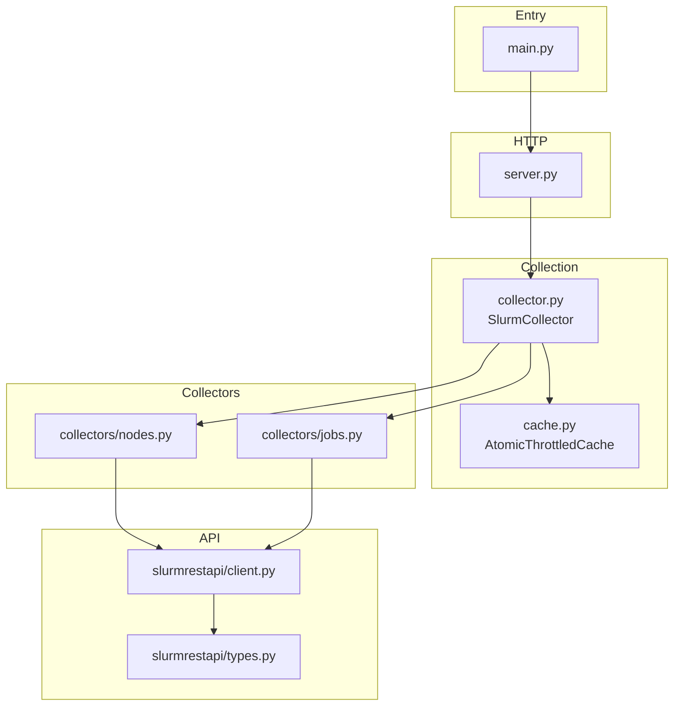

# SLURM Prometheus Exporter

A Prometheus exporter for SLURM workload manager that exposes cluster metrics via the 
SLURM REST API.

## Repo Structure

The package is organized into four main components:

- **`main.py`** - Entry point that loads configuration, performs dependency injection, and starts the HTTP server (ASGI app factory for any server).
- **`server.py`** - ASGI app factory, HTTP server setup, configuration, and collectors wiring.
- **`collector.py`** - Generic `SlurmCollector` implementing the Prometheus `Collector` interface. Uses composition to separate fetching, caching, and metric generation.
- **`cache.py`** - Thread-safe `AtomicThrottledCache` that rate-limits API requests and returns cached data within the throttle window.
- **`collectors/`** - Domain-specific collectors (`nodes.py`, `jobs.py`) that fetch data from the API, transform it, and generate Prometheus metrics.
- **`slurmrestapi/`** - REST API client (`client.py`) and Pydantic models (`types.py`) for SLURM API responses.



## Running locally

Use any ASGI server, for example `uvicorn`.

```bash
SLURM_EXPORTER_CONFIG_PATH=config.json uv run uvicorn slurm_prometheus_exporter.server:create_app --factory --host 0.0.0.0 --port 9092
```

You can query metrics using the command below.

```bash
curl http://localhost:9092/metrics
```
